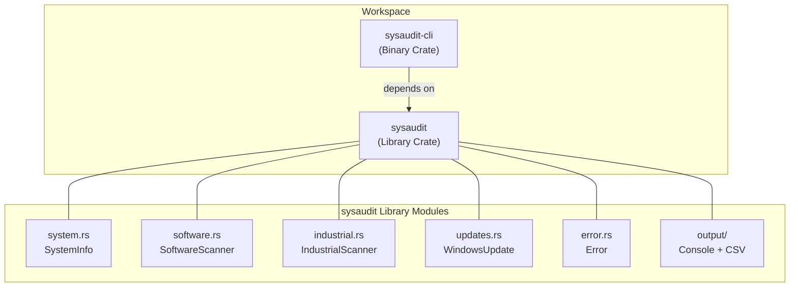
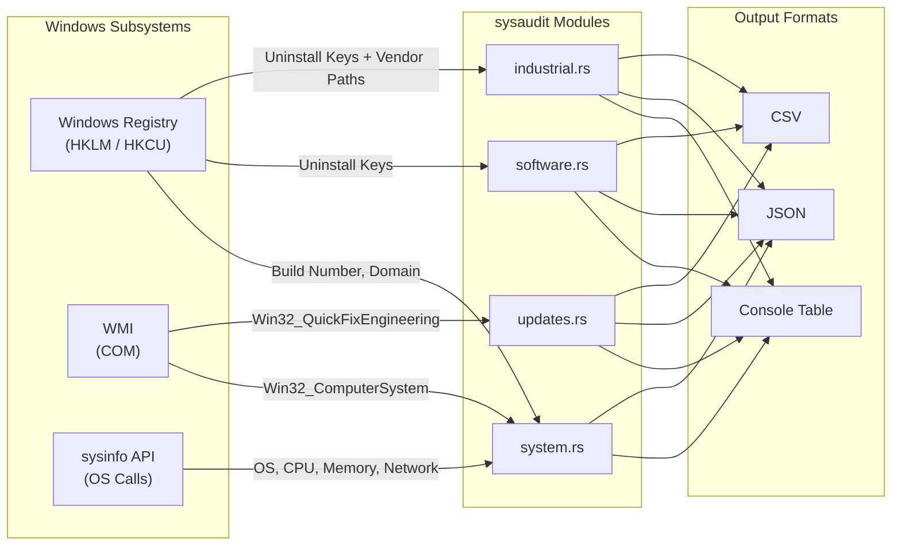

# 🏗️ Architecture: sysaudit

> **Technical Source of Truth** — This file concretizes every `<!-- CUSTOMIZE -->` marker in [`GEMINI.md`](GEMINI.md).

---

## 1. Project Overview

| | |
|:---|:---|
| **Name** | sysaudit |
| **Purpose** | High-performance Rust library and CLI for **read-only** auditing of Windows systems: software inventory, hardware info, update patches, and industrial software detection. |
| **Repository** | <https://github.com/wends155/sysaudit> |
| **License** | MIT |
| **Last Audited** | 2025-02-17 |

---

## 2. Language & Runtime

| | |
|:---|:---|
| **Language** | Rust |
| **Edition** | 2024 |
| **MSRV** | 1.85 |
| **Target** | `x86_64-pc-windows-msvc` |
| **Runtime** | Synchronous (no async runtime in the core library; `tokio` used only in dev-tests) |

---

## 3. Project Layout

```
sysaudit/                      ← workspace root
├── Cargo.toml                 ← workspace manifest (resolver = "2")
├── Makefile                   ← build / quality / verify targets
├── GEMINI.md                  ← Operational rules (How we build)
├── architecture.md            ← This file (What we are building)
├── context.md                 ← History & decisions (Why we built it)
├── DATA_SOURCES.md            ← Windows data source reference
├── README.md                  ← Project documentation
├── LICENSE                    ← MIT License
├── .gitignore                 ← Git exclusion rules
├── scripts/
│   ├── test_all.sh            ← Quality gate (lint + test + fmt)
│   ├── run_cli_tests.sh       ← CLI integration test runner
│   └── verify_output.ps1      ← WMI comparison verification
│
├── sysaudit/                  ← Core library crate (published)
│   ├── Cargo.toml
│   ├── README.md
│   └── src/
│       ├── lib.rs             ← Public API re-exports
│       ├── error.rs           ← Unified Error enum (thiserror)
│       ├── system.rs          ← SystemInfo, NetworkInterface
│       ├── software.rs        ← SoftwareScanner, Software, RegistrySource
│       ├── industrial.rs      ← IndustrialScanner, Vendor, IndustrialSoftware
│       ├── updates.rs         ← WindowsUpdate (WMI)
│       └── output/
│           ├── mod.rs
│           ├── console.rs     ← ConsoleFormatter (comfy-table)
│           └── csv_output.rs  ← CsvExporter
│
└── sysaudit-cli/              ← CLI binary crate
    ├── Cargo.toml
    ├── README.md
    ├── src/
    │   └── main.rs            ← clap-based CLI (bin name: "sysaudit")
    └── tests/
```

---

## 4. Toolchain

| Tool | Command |
|:---|:---|
| **Formatter** | `cargo fmt --all` |
| **Format Check** | `cargo fmt --all -- --check` |
| **Linter** | `cargo clippy --workspace --all-targets -- -D warnings` |
| **Test** | `cargo test --workspace --all-features` |
| **Build (debug)** | `cargo build --workspace` |
| **Build (release)** | `cargo build --workspace --release` |
| **Docs** | `cargo doc --workspace --no-deps --open` |
| **Full Quality Gate** | `make all` → fmt → lint → test → build |
| **CI Simulation** | `make ci` → fmt-check → lint → test → build → docs |
| **Verification** | `make check` (runs `scripts/test_all.sh`) |
| **WMI Verify** | `make verify` (runs `scripts/verify_output.ps1`) |

### Verification Script (`scripts/test_all.sh`)

```sh
#!/bin/sh
set -e

echo "Running tests..."
cargo test --workspace --all-features

echo "Running clippy..."
cargo clippy --workspace --all-targets -- -D warnings

echo "Checking formatting..."
cargo fmt -- --check

echo "All checks passed!"
```

### Zero-Exit Requirement Mapping

```
Formatting:  cargo fmt --all -- --check
Linting:     cargo clippy --workspace --all-targets -- -D warnings
Testing:     cargo test --workspace --all-features
```

---

## 5. Error Handling Strategy

**Pattern:** `Result<T, sysaudit::Error>` + `thiserror` derive macro.

```rust
#[derive(thiserror::Error, Debug)]
pub enum Error {
    #[error("Registry error: {0}")]  Registry(#[from] windows_result::Error),
    #[error("WMI error: {0}")]       Wmi(#[from] wmi::WMIError),
    #[error("IO error: {0}")]        Io(#[from] std::io::Error),
    #[error("CSV error: {0}")]       Csv(#[from] csv::Error),
    #[error("JSON error: {0}")]      Json(#[from] serde_json::Error),
    #[error("Date parse error: {0}")] DateParse(String),
    #[error("{0}")]                  General(String),
}
```

**Rules:**
- Every variant uses `#[from]` for ergonomic `?` propagation.
- **No panics** in library code — all fallible operations return `Result`.
- **Graceful degradation:** `WindowsUpdate::collect_all()` catches WMI errors and returns an empty `Vec` with an `eprintln!` warning, rather than propagating.
- CLI prints errors to stderr via `eprintln!` and exits with code `1`.

---

## 6. Observability & Logging

| Aspect | Current State |
|:---|:---|
| **Framework** | `tracing` (instrumentation) + `tracing-subscriber` (CLI output) |
| **Warnings** | `tracing::warn!` for non-fatal failures (e.g., WMI unavailable) |
| **Error Output** | CLI prints structured error events and exits with code 1 |

**Log levels and filtering:**
- **Debug builds:** Default filter is `debug` (shows `DEBUG`, `INFO`, `WARN`, `ERROR`)
- **Release builds:** Default filter is `error` (shows `ERROR` only)
- **Override:** Use `RUST_LOG` environment variable to override at runtime.

**Leveled usage:**
- **Error:** Critical command failure in CLI
- **Warn:** Graceful degradation paths (e.g., WMI query failure in `updates.rs`)
- **Info:** High-level milestones (e.g., "Starting software scan")
- **Debug:** Internal state details, found item counts
- **Trace:** Not yet used (reserved for raw byte/registry data)

---

## 7. Testing Strategy

| Aspect | Details |
|:---|:---|
| **Framework** | Built-in `#[test]` + `cargo test` |
| **Unit tests** | Co-located via `#[cfg(test)] mod tests` in each source module |
| **Integration tests** | `sysaudit-cli/tests/` directory |
| **Doc tests** | `/// ```no_run` on all public API functions |
| **Dev dependency** | `tokio` (async WMI test support) |
| **Mocking** | None yet — tests run against a live Windows system |

**Test file placement:**
- `sysaudit/src/system.rs` → `mod tests` (3 tests: system info, MAC format, build number)
- `sysaudit/src/software.rs` → `mod tests` (3 tests: date parsing valid/invalid/future)
- `sysaudit/src/updates.rs` → `mod tests` (2 tests: WMI date formats)
- `sysaudit/src/industrial.rs` → No unit tests (Logic tested via CLI integration tests)

> [!NOTE]
> All tests require a live Windows machine with registry and WMI access. Doc tests use `no_run` to avoid CI failures on non-Windows platforms.

---

## 8. Documentation Conventions

| Aspect | Convention |
|:---|:---|
| **Item docs** | `///` (Rustdoc) |
| **Module docs** | `//!` at top of each file |
| **Structure** | Description → Example (`no_run`) → Errors |
| **Generate** | `cargo doc --workspace --no-deps --open` |
| **docs.rs config** | `default-target = "x86_64-pc-windows-msvc"` in `Cargo.toml` |

**Example pattern:**
```rust
/// Collect system information (READ-ONLY).
///
/// # Example
///
/// ```no_run
/// use sysaudit::SystemInfo;
///
/// let info = SystemInfo::collect().unwrap();
/// println!("Computer: {}", info.computer_name);
/// ```
pub fn collect() -> Result<Self, Error> { ... }
```

---

## 9. Dependencies & External Systems

### Crate Dependencies

| Crate | Version | Purpose |
|:---|:---|:---|
| `sysinfo` | 0.32 | OS name, version, CPU, memory, network interfaces |
| `windows-registry` | 0.4 | Registry key enumeration (software, build number, domain) |
| `windows-result` | 0.3 | Error types for registry operations |
| `wmi` | 0.14 | WMI queries (updates, manufacturer/model) |
| `serde` | 1.0 | Serialization framework (`derive` feature) |
| `serde_json` | 1.0 | JSON output |
| `chrono` | 0.4 | Date parsing (`serde` feature) |
| `thiserror` | 2.0 | Error enum derive macro |
| `csv` | 1.3 | CSV export |
| `comfy-table` | 7.1 | Console table formatting |
| `clap` | 4.5 | CLI argument parsing (`derive` feature, `sysaudit-cli` only) |
| `tracing` | 0.1 | Structured logging instrumentation |
| `tracing-subscriber` | 0.3 | CLI log output formatter (`env-filter` feature) |
| `tokio` | 1 | Dev-only: async test runtime |

### Windows Data Sources (from `DATA_SOURCES.md`)

#### System Information
| Field | Source | Details |
|:---|:---|:---|
| OS Name / Version | `sysinfo` API | `System::name()`, `System::os_version()` |
| Build Number + UBR | Registry | `HKLM\SOFTWARE\Microsoft\Windows NT\CurrentVersion` |
| Computer Name | `sysinfo` API | `System::host_name()` |
| Domain | Registry | `HKLM\SYSTEM\CurrentControlSet\Services\Tcpip\Parameters` |
| CPU / Memory | `sysinfo` API | Brand, cores, frequency, total/used/free memory |
| Manufacturer / Model | WMI | `Win32_ComputerSystem` |
| Network Interfaces | `sysinfo` API | IP, subnet prefix, MAC address |

#### Installed Software — Registry Locations
1. **64-bit:** `HKLM\SOFTWARE\Microsoft\Windows\CurrentVersion\Uninstall`
2. **32-bit (WOW64):** `HKLM\SOFTWARE\WOW6432Node\Microsoft\Windows\CurrentVersion\Uninstall`
3. **Per-User:** `HKCU\SOFTWARE\Microsoft\Windows\CurrentVersion\Uninstall`

**Fields:** `DisplayName` (required), `DisplayVersion`, `Publisher`, `InstallDate` (YYYYMMDD), `InstallLocation`

#### Industrial Software
Vendor matching by filtering the software list: Citect/AVEVA, Digifort, ABB, Rockwell/Allen-Bradley, Siemens, Schneider Electric.

#### Windows Updates
- **WMI Class:** `Win32_QuickFixEngineering`
- **Fields:** `HotFixID`, `Description`, `InstalledOn`, `InstalledBy`
- **Fallback:** Returns empty list + warning if WMI is corrupted.

---

## 10. Architecture Diagrams

### Component Overview



### Data Source Flow



---

## 11. Known Constraints & Bugs

| Constraint | Details |
|:---|:---|
| **Windows-only** | Compiles and runs only on `x86_64-pc-windows-msvc`. |
| **No admin required** | All operations are read-only; no elevation needed. |
| **WMI fragility** | If `Win32_QuickFixEngineering` is unavailable or WMI is corrupted, the updates section returns an empty list with a warning. |
| **No async** | Library is fully synchronous; WMI/COM calls may block the calling thread. |
| **Industrial vendor list** | Hardcoded in `industrial.rs`; adding new vendors requires code changes. |
| **Gateway info** | `NetworkInterface.gateway` is always `None` (sysinfo API limitation). |
| **No mocking** | Tests require a live Windows machine; no mock infrastructure for registry/WMI. |
