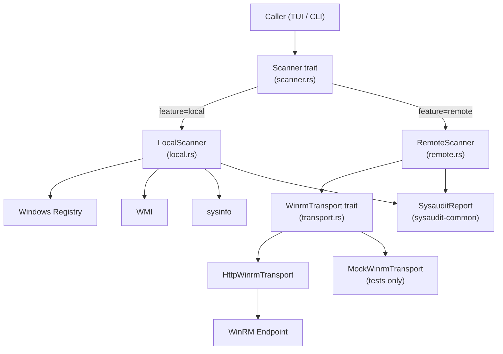

# Architecture: sysaudit

## 1. Project Overview

`sysaudit` is a Windows-only Rust library that performs read-only system audits.
It enumerates installed software (from the Windows registry), industrial automation
software (Citect, Rockwell, Siemens, ABB, Schneider, Digifort), hardware/OS info,
and Windows update history. It supports both **local** (registry/WMI/sysinfo) and
**remote** (WinRM via WS-Man) collection strategies via a unified `Scanner` trait.

## 2. Language & Runtime

| Parameter | Value |
|-----------|-------|
| Language | Rust 2024 edition |
| MSRV | 1.85 |
| Runtime | Windows (x86_64-pc-windows-msvc) |
| Async | `tokio` (rt, time) |
| Features | `local` (default), `remote` |

## 3. Project Layout

```
sysaudit/
├── Cargo.toml
├── architecture.md   ← this file
├── spec.md
└── sysaudit/
    └── src/
        ├── lib.rs            # Public re-exports
        ├── error.rs          # Error types
        ├── scanner.rs        # Scanner trait + ScanError
        ├── local.rs          # LocalScanner (feature=local)
        ├── remote.rs         # RemoteScanner (feature=remote)
        ├── remote/
        │   ├── payload.rs    # PowerShell WinRM payload
        │   └── transport.rs  # WinrmTransport trait + HttpWinrmTransport
        ├── system.rs         # SystemInfo (OS, CPU, RAM, network)
        ├── software.rs       # SoftwareScanner (registry)
        ├── industrial.rs     # IndustrialScanner (SCADA/ICS vendors)
        ├── updates.rs        # WindowsUpdate (WMI)
        └── output/
            ├── mod.rs
            ├── console.rs    # ConsoleFormatter (comfy-table)
            └── csv_output.rs # CsvExporter
```

## 4. Toolchain

| Tool | Command |
|------|---------|
| Formatter | `cargo fmt -p sysaudit` |
| Linter | `cargo clippy -p sysaudit --all-features -- -D warnings` |
| Tests | `cargo test -p sysaudit` |
| Docs | `cargo doc -p sysaudit --no-deps --open` |

**Verification gate (must all exit 0 before merging):**
```powershell
cargo fmt -p sysaudit -- --check
cargo clippy -p sysaudit --all-features -- -D warnings
cargo test -p sysaudit
```

## 5. Error Handling Strategy

- **Library errors**: `crate::Error` via [`thiserror`](https://docs.rs/thiserror) — covers Registry, WMI, IO, CSV, JSON, DateParse, General.
- **Scanner errors**: `ScanError` via `thiserror` — covers Local, RemoteConnection, RemoteAuth, RemoteExecution, Deserialization, Timeout.
- **`#[non_exhaustive]`** applied to `ScanError` to allow future variants without breaking callers.
- **No `unwrap()`** in production code; all fallible paths use `?` or structured `match`.
- **Graceful degradation**: Optional WMI info (model, updates) falls back to `None`/empty with `tracing::warn!`.

## 6. Observability & Logging

| Framework | `tracing` v0.1 |
|-----------|----------------|
| Instrumentation | `#[tracing::instrument]` on `SystemInfo::collect`, `LocalScanner::scan` |
| Level usage | `tracing::warn!` for optional WMI fallbacks; callers install their own subscriber |
| Pattern | Structured fields: `tracing::warn!(error = %e, "message")` |

> [!NOTE]
> `sysaudit` is a library — it does not configure a global subscriber. The binary/TUI layer is responsible for installing `tracing_subscriber`.

## 7. Testing Strategy

| Type | Location | Framework |
|------|----------|-----------|
| Unit tests | Co-located in `src/*.rs` under `#[cfg(test)]` | `std::test` |
| Async tests | `#[tokio::test]` | `tokio` |
| Mock transport | `MockWinrmTransport` via `mockall::automock` | `mockall` v0.14 |
| Doc tests | Inline `/// \`\`\`no_run` examples | Rustdoc |

**Mocking pattern**: `WinrmTransport` is abstracted behind a trait with `#[cfg_attr(test, mockall::automock)]`, allowing `RemoteScanner` to be tested without a live WinRM host.

## 8. Documentation Conventions

- `//!` module-level doc on every `src/*.rs` file.
- `///` item-level doc on every `pub` function, struct, and enum.
- `# Examples` with `no_run` on public constructors and scan methods.
- `# Errors` on every public function returning `Result`.
- Format: standard Rustdoc.

## 9. Dependencies & External Systems

| Dependency | Purpose |
|------------|---------|
| `thiserror` | Typed error derives |
| `tracing` | Structured logging (library-level) |
| `serde` + `serde_json` | Serialization |
| `chrono` | Date handling |
| `windows-registry` | Registry access (feature=local) |
| `wmi` | WMI queries (feature=local) |
| `sysinfo` | Cross-platform system info (feature=local) |
| `reqwest` | HTTP client for WinRM (feature=remote) |
| `bon` | Builder pattern for `RemoteScanner` |
| `secrecy` | Memory-safe password handling |
| `csv` + `comfy-table` | Output formatting |
| `mockall` (dev) | Mock traits in tests |

**External systems**: Windows Registry, WMI (Win32_QuickFixEngineering, Win32_ComputerSystem), WinRM endpoint (WS-Man over HTTP/HTTPS).

## 10. Architecture Diagrams



## 11. Known Constraints & Bugs

| Constraint | Detail |
|------------|--------|
| Windows-only | `local` feature uses Windows-specific APIs (Registry, WMI). The crate will not compile on Linux/macOS with `--features local`. |
| WS-Man stub | `HttpWinrmTransport::execute` is a stub returning `ScanError::RemoteExecution`. Full WS-Man SOAP protocol pending. |
| `skip_cert_verify` unimplemented | `reqwest` with `rustls` does not expose `danger_accept_invalid_certs`; TLS cert bypass is currently commented out. |
| `industrial.rs` no unit tests | Registry-dependent scanners require a live Windows environment; not easily mockable without restructuring to accept injectable key handles. |
| `WindowsUpdate` not in `SysauditReport` | `updates.rs` data is intentionally not mapped to `SysauditReport` DTO (see comment in `local.rs`). |
